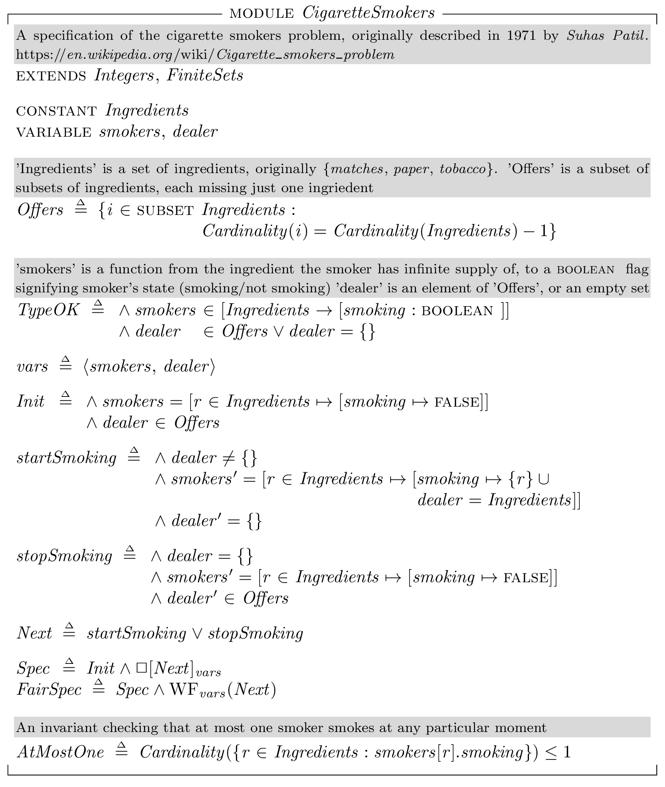
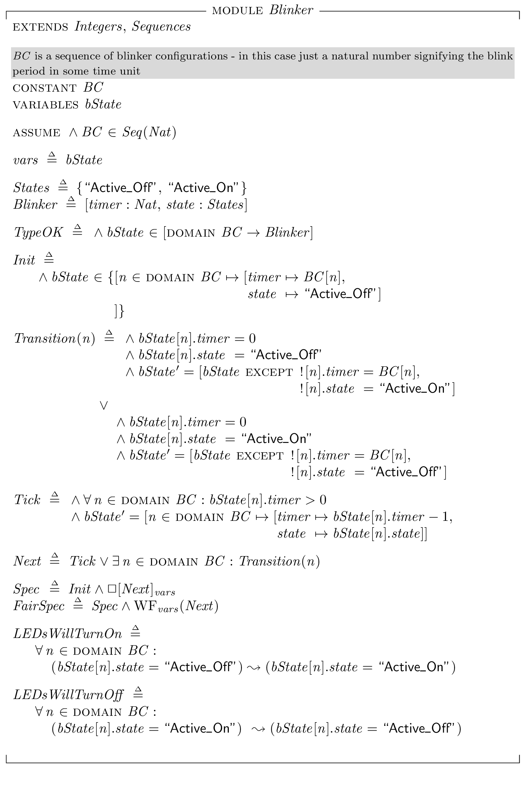

Different TLA+ specifications, mostly for learning purposes
===========================================================

CigaretteSmokers.tla
--------------------

A specification of the [Cigarette smokers problem](https://en.wikipedia.org/wiki/Cigarette_smokers_problem).
The generated state graph is very small:

Blinker.tla
-----------

Simple spec simulating, more or less, [this](https://github.com/mryndzionek/esm/blob/master/apps/blink/src/blink.c) application.
Three state machines controlling three LEDs. With 100ms resolution (model run with `BC <- <<3, 5, 7>>`) model checker
finds 384 distinct states:

Just a humble reminder to never underestimate even the simplest concurrent programs, I guess :smiley:
