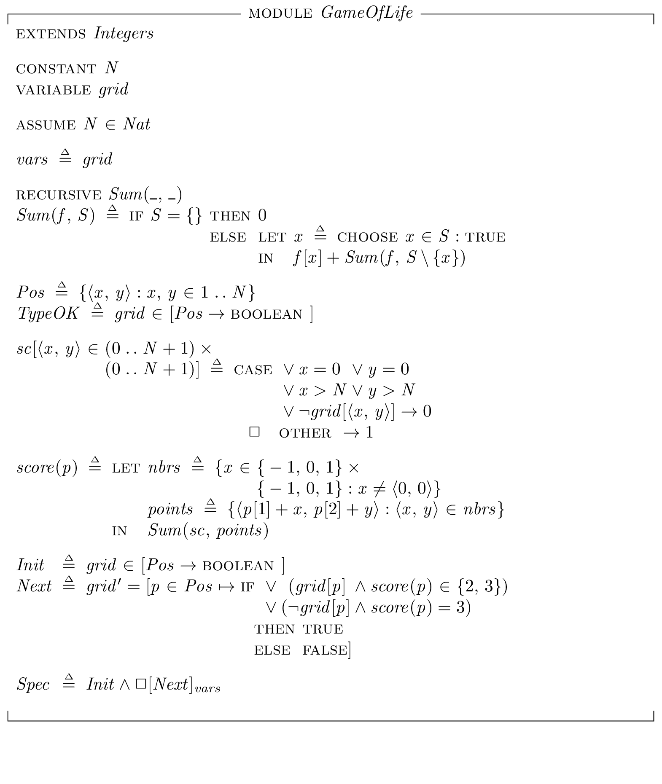
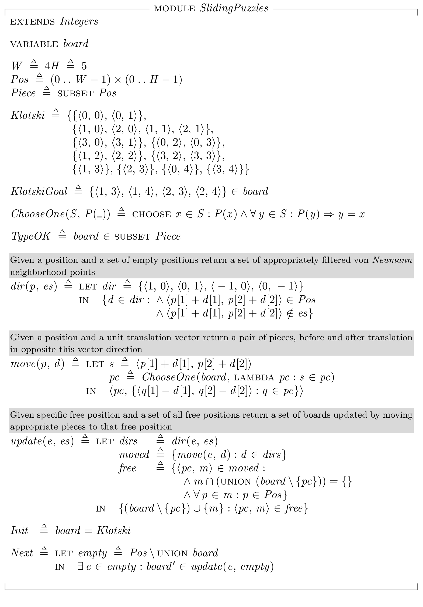

Different TLA+ specifications, mostly for learning purposes
===========================================================

CigaretteSmokers.tla
--------------------

A specification of the [Cigarette smokers problem](https://en.wikipedia.org/wiki/Cigarette_smokers_problem).
The generated state graph is very small:


Blinker.tla
-----------

Simple spec simulating, more or less, [this](https://github.com/mryndzionek/esm/blob/master/apps/blink/src/blink.c) application.
Three state machines controlling three LEDs. With 100ms resolution (model run with `BC <- <<3, 5, 7>>`) model checker
finds 384 distinct states:


Just a humble reminder to never underestimate even the simplest concurrent programs, I guess :smiley:

GameOfLife.tla
--------------

[Conway's Game of Life](https://en.wikipedia.org/wiki/Conway%27s_Game_of_Life)



All the 'attractors' for a 3x3 grid


State space for a 4x4 grid - original image generated by Graphviz is around 300MB :smiley::


The same with some colors based on number of occupied cells:


Zoom on two of the smaller clusters:


Under 'symmetry group of the square' (D<sub>4</sub>) view in TLC the state space shrinks to ... 27 states.
Under this view it's even possible to run TLC on 5x5 grid and get 486 states (reduction from 33554432):


Base Graphviz parameters:

```sh
dot -Tpng -Nstyle=filled -Npenwidth=5 -Epenwidth=8 -Ksfdp -Goverlap=prism -Goverlap_scaling=-10
```

Requirements.tla
----------------

Experimental specification aimed at mechanising verification of written requirements documents.


Checking `CheckRequirements` spec produces:


SlidingPuzzles.tla
------------------

Solution to a variation of [sliding block puzzle](https://en.wikipedia.org/wiki/Sliding_puzzle)
most commonly known as [Klotski](https://en.wikipedia.org/wiki/Klotski).



TLC finds 25955 distinct states. Green node is the starting position.
Red nodes are the goal nodes - with the biggest piece in center-bottom position.


The Pennant variation has significantly smaller state space of 'only' 1398 states.
Raymond Hettinger talked about this puzzle and the state graph [here](https://youtu.be/_GP9OpZPUYc?t=742).

```tla
W == 4 H == 5

Pennant == {{<<0, 0>>, <<0, 1>>, <<1, 0>>, <<1, 1>>},
            {<<2, 0>>, <<3, 0>>}, {<<2, 1>>, <<3, 1>>},
            {<<0, 2>>}, {<<1, 2>>},
            {<<0, 3>>, <<0, 4>>}, {<<1, 3>>, <<1, 4>>},
            {<<2, 3>>, <<3, 3>>}, {<<2, 4>>, <<3, 4>>}}
            
PennantGoal == {<<0, 3>>, <<0, 4>>, <<1, 3>>, <<1, 4>>} \in board
```


Ma's Puzzle has 110804 distinct states.

```tla
W == 5 H == 5

Mas == {{<<0, 0>>, <<1, 0>>, <<2, 0>>},
        {<<3, 0>>, <<4, 0>>,<<4, 1>>},
        {<<0, 1>>, <<1, 1>>}, {<<2, 1>>, <<3, 1>>},
        {<<0, 2>>, <<0, 3>>, <<1, 3>>},
        {<<1, 2>>, <<2, 2>>}, {<<3, 2>>, <<4, 2>>},
        {<<2, 3>>, <<3, 3>>, <<4, 3>>},
        {<<2, 4>>}}
        
MasGoal == {{<<3, 0>>, <<4, 0>>,<<4, 1>>}, {<<3, 1>>, <<3, 2>>, <<4, 2>>}} \subseteq board
```


